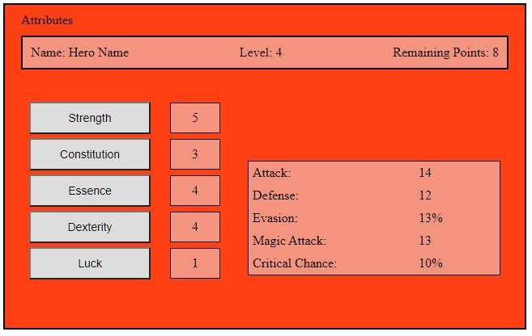

# HeroPath

I'm working on an incremental browser game in my spare time to learn the basics of javascript. It's in an early stage but the first few features are implemented and you can see what it's going to be. You can play it under this [link](winchesterop.github.io/heropath/). further down you can see the list of next implementations that are planned.

## Getting Started

[To the Game](winchesterop.github.io/heropath/)

## Screenshots

## What next?

- Main
  - [x] Main-Design
  - [ ] Remade Main-Design
  - [x] World Navigation
  - [x] Attributes
  - [ ] more complex attribute effects
  - [x] Battles
  - [ ] automatic battles
  - [x] Quest 
  - [ ] Inventory
  - [ ] Equipment
  - [ ] Saving
  - [ ] more world locations
